# magicplan (iOS) — Product & Design Reference

**Purpose:** structural reference for rebuilding a comparable floor-plan capture app.
**Captured:** 14 Aug 2026 via iPhone Mirroring on macOS, across two sessions.
**Subject:** magicplan (vendor: Sensopia). Account = workspace *Owner*, subscription tier shown as *Report*.

**Scope and IP note.** This documents navigation, workflow, data model and interaction patterns — the reusable parts. It does **not** reproduce their icon set, 3D object renders, illustrations or copy verbatim beyond short quoted labels needed to describe behaviour. When rebuilding: the flows and structure here are yours to reuse; the artwork, object library renders, and distinctive visual trade dress are not — commission your own.

**What was not touched:** no purchases, sign-ups, sends, publishes or deletions. The seven pre-existing projects were left unmodified.

**One artefact created:** exploring `New Project` immediately creates a project (there is no wizard), so a sandbox project called *"My New Project"* now exists in the workspace with one Ground Floor, one Living Room and one Arch Door. All destructive/mutating exploration was confined to it. It is still there — archive it whenever you like, or say the word and I will.

---

## 1. What the product actually is

Two layers, and the second is the one that's easy to miss:

1. **A measurement/CAD engine** — capture room geometry (LiDAR scan, manual draw, or template), render it as 2D plan / 3D model / wall elevations, compute areas and volumes.
2. **A structured-data and reporting platform bolted onto it** — every entity (project, floor, room, object) carries user-definable fields, photos, notes and forms, and the whole thing exports as branded PDF/CSV/DXF/IFC deliverables.

Evidence for layer 2 being the commercial core: the project metadata screen ships with a **Claim Details** field group (Job Number, Carrier Name, Insurance Claim Number, Adjuster Name, Adjuster Email, Property Type, Type of Loss, Loss Date), and there is a **Living Area Calculation** rules engine. The target buyer is a restoration contractor, insurance adjuster or appraiser, not a homeowner sketching a room. If you rebuild only layer 1 you have built a toy.

---

## 2. Navigation map

```
Tab bar (2 tabs, always present)
├── Projects
│   └── Projects list  ── workspace switcher, search, All/Favorites/Archived
│       └── Project detail
│           ├── Project Info (name, description, author, date,
│           │                 Living Area Calculation, Claim Details fields)
│           ├── Address
│           ├── Forms
│           ├── Statistics ── See All (Rooms | Objects)
│           ├── Floor Plans ──> FLOOR PLAN EDITOR
│           ├── Photos
│           └── Files (generated exports land here)
└── My Account
    ├── Profile
    ├── Company Profile (logo, contact, address, export watermark)
    ├── Subscription
    ├── App Preferences (units, AR scan mode, photo library, sync, cache)
    ├── Privacy (analytics toggle, policy links)
    └── Help & Support, diagnostics, feedback links
```

**Editor stack** — one screen, three selection depths, plus a view-mode axis:

```
FLOOR level      ── bottom bar: Insert | Rotate
  └ ROOM level   ── bottom bar: Insert | Set Size* | Edit Layout | Duplicate | Delete
      └ OBJECT   ── bottom bar: Insert | Replace with… | Rotate† | Duplicate | Delete

view modes: 2D (editable) · 3D (read-only) · Elevation (only inside a room)
* Set Size appears for template/square rooms
† Rotate drops out in Elevation view
```

Every level has the **same swipe-up inspector** with the same three tabs: *Details · Photos & Notes · Forms*. That consistency is the single most copyable thing in the app.

---

## 3. Data model

### Entity hierarchy

```
Workspace
└── Project           name, description, author, creation date, address,
│                     Living Area Calculation config, custom field groups,
│                     photos[], files[], forms[]
└── Floor             name, ceiling height, interior wall thickness,
    │                 exterior wall thickness, custom fields, photos, notes, forms
    └── Room          name, room type, floor ref, colour, ceiling height,
        │             living-area %, affected areas[], custom fields,
        │             photos, notes, forms
        ├── Wall      length (derived or manually locked), openings[]
        └── Object    catalogue ref, width, height, distance-to-floor,
                      display-label mode, include-in-PDF flag,
                      custom fields, photos, notes, forms
```

### Field system

Every entity screen ends with `+ New Field` (an ↗ external/upgrade affordance). Field types observed in the shipped **Claim Details** group:

| Type | Example |
|---|---|
| Text | Job Number, Carrier Name, Adjuster Name |
| Email | Adjuster Email |
| Select / enum | Property Type, Type of Loss |
| Date | Loss Date, Project creation date |
| Photo | Front View Photo |
| Number / percentage | Living Area (%) |
| Measurement | Ceiling Height, Width, Distance to Floor |
| Toggle | Include in PDF, Include interior walls |

Field *groups* are themselves editable (`Claim Details` has an `Edit ↗` control). Build this as a template system from day one — retrofitting it is painful.

### Dimension locking

A wall dimension the user types is **locked** and marked with a padlock glyph next to the value; opposite/derived walls show no padlock. This drives the export option *"Only dimensions that have been manually set"*. Store `isManuallySet` per dimension.

### Living Area Calculation

Project-level rules engine:

- `Include interior walls` (default off)
- `Include areas with a min. height` (default **2.134 m** = 7 ft — the ANSI Z765 threshold)
- Per-room-type inclusion percentage, e.g. Basement 0%, Balcony 0%, Archives 100%, Attic/Loft 100%, Bathroom 100%, Bedroom 100%, …

Each room then carries its own `Living Area (%)` override. Total living area = Σ(room area × applicable %).

### Statistics vocabulary

The `Statistics → See All` screen is the measurement contract. Tabs **Rooms | Objects**; every metric row has an `(i)` with a formal definition (e.g. *"Ground surface with all walls"* is defined as the footprint measured to the outside face of exterior walls, without deductions).

Metrics: Floors · Rooms · Doors · Windows · Ground surface with all walls · Ground surface with interior walls · Ground surface without walls · Walls with openings · Walls without openings · Ceiling perimeter · Ground perimeter · Above grade living area · Below grade living area · Total living area · Volume.

The **Objects** tab is a bill of materials: grouped by category, each row = thumbnail + name + count.

Precision observed: areas 2 dp m², lengths 3 dp m, volume 2 dp m³.

**Formulas verified** against a controlled 4.000 × 2.500 m test room (ceiling 2.440 m, interior walls 0.120 m, exterior 0.250 m). Every reported figure reproduces exactly, which pins down the definitions:

| Metric | Reported | Reproduces as |
|---|---|---|
| Ground surface without walls | 10.00 m² | `4.000 × 2.500` — interior clear dimensions |
| Ground surface with all walls | 13.50 m² | `(4.000 + 2×0.250) × (2.500 + 2×0.250)` — to the outside face of exterior walls, no deductions |
| Ceiling perimeter | 13.00 m | `2 × (4.000 + 2.500)` — interior perimeter at ceiling |
| Ground perimeter | 12.10 m | shorter than the ceiling perimeter; consistent with wall-base insets rather than clear dimensions |
| Volume | 24.40 m³ | `10.00 × 2.440` |
| Walls without openings | 29.52 m² | `12.10 × 2.440` — **ground** perimeter × ceiling height, not ceiling perimeter |

Two things to carry over: ground and ceiling perimeter are genuinely different numbers, and wall area is derived from the *ground* perimeter. Getting either wrong produces figures that look plausible and are wrong by a few percent — exactly the kind of error that survives QA and then loses an insurance dispute.

---

## 4. Screens

### 4.1 Projects list

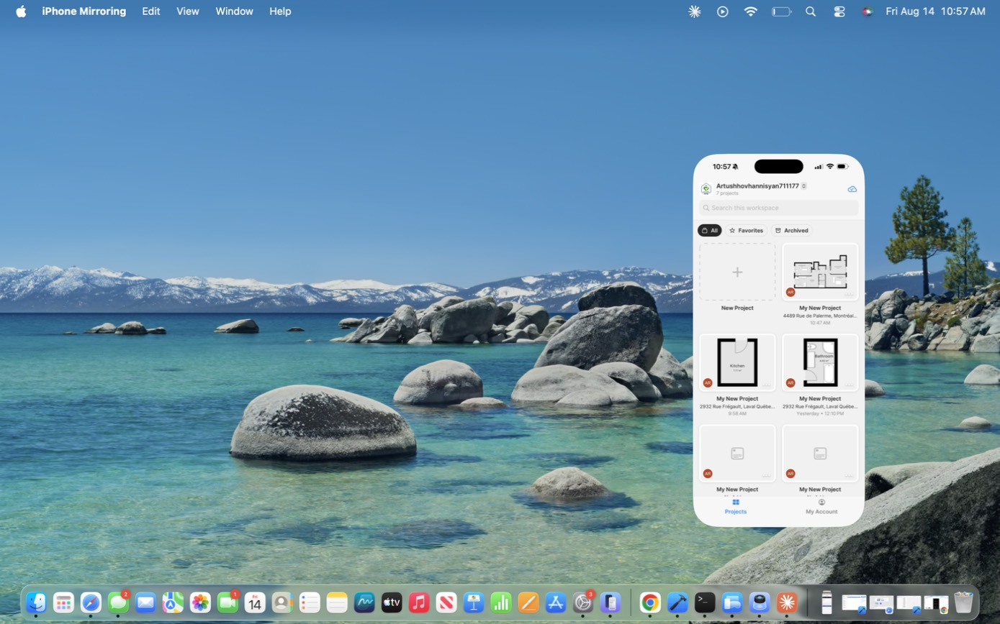 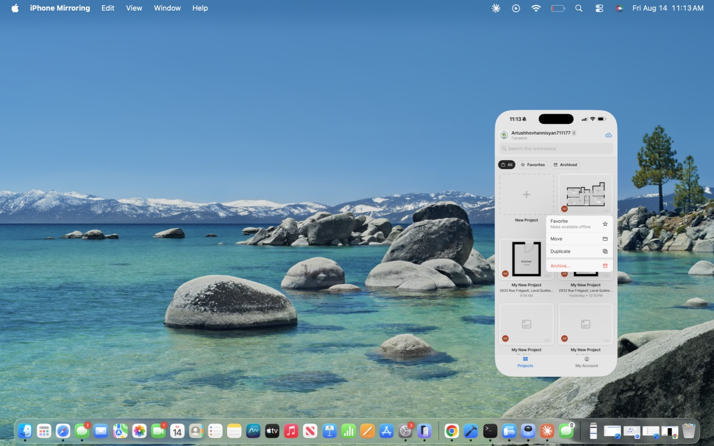

| Region | Contents |
|---|---|
| Header | workspace avatar + name + `⌄` switcher, `n projects` caption (respects active filter), cloud-sync icon |
| Search | `Search this workspace` |
| Filters | `All` · `Favorites` (star) · `Archived` (box) — selected chip is a solid dark pill |
| Grid | 2 columns; first cell is a dashed `New Project` tile |
| Tab bar | Projects · My Account |

**Card:** plan thumbnail (or generic doc glyph), member avatar circle bottom-left, `···` bottom-right, then centred title, address or `No Address`, timestamp.

**Card `···` menu:** Favorite (*Make available offline*) · Move · Duplicate · Archive… (red).

**Empty states carry the product education:**

- Favorites — *"When you favorite a project, all project data is stored on-device for offline access! Any changes you make are synced as soon as you're back online."*
- Archived — *"Archived projects are stored indefinitely. You can either recover them or permanently delete them at any time."*

Archive is a **soft delete with indefinite retention**, not a delete. Copy this.

**Workspace switcher:** modal radio list, current workspace tagged with a yellow `Current` chip, primary button `Select a Workspace` (disabled when nothing changes).

**New Project:** no wizard — one tap creates `My New Project` and pushes straight into the empty project detail. Fast, but it's why this account has seven identically-named projects. If you rebuild this, either prompt for a name or auto-name from address/date.

### 4.2 Project detail

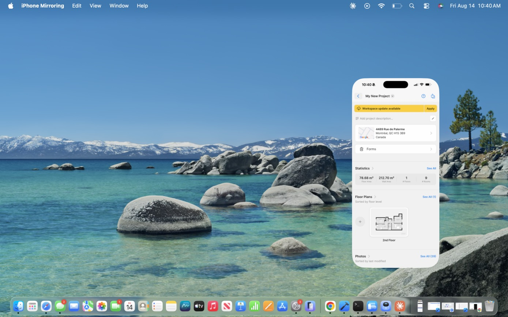

Nav bar: back · title + `⌄` menu · `?` · share/export.

**Title `⌄` menu:** Export… · Edit Project Details · Favorite · Move · Duplicate · Archive… (red).

Sectioned scroll:

1. Sync banner (yellow) — `Workspace update available` + `Apply`. Sync is explicit, never silent.
2. `Add project description…` with pencil
3. Address card with map thumbnail
4. `Forms`
5. **Statistics** — 4 stat tiles (Floor Area, Wall Area, # Floors, # Rooms) + `See All`
6. **Floor Plans** — `See All (n)`, "Sorted by floor level", rail with leading `+`
7. **Photos** — `See All (n)`, "Sorted by last modified", captions read `<Floor> • <Room>`, video/360 badges
8. **Files** — generated exports (e.g. `<Project> Report`, PDF-badged)
9. Created By / Last Modified By

Empty sections swap the sort caption for a value proposition: *"Create, edit and share floor plans."* / *"Add photos and share reports."* / *"Scan or upload documents from your device."*

### 4.3 Project Info (Edit Project Details)

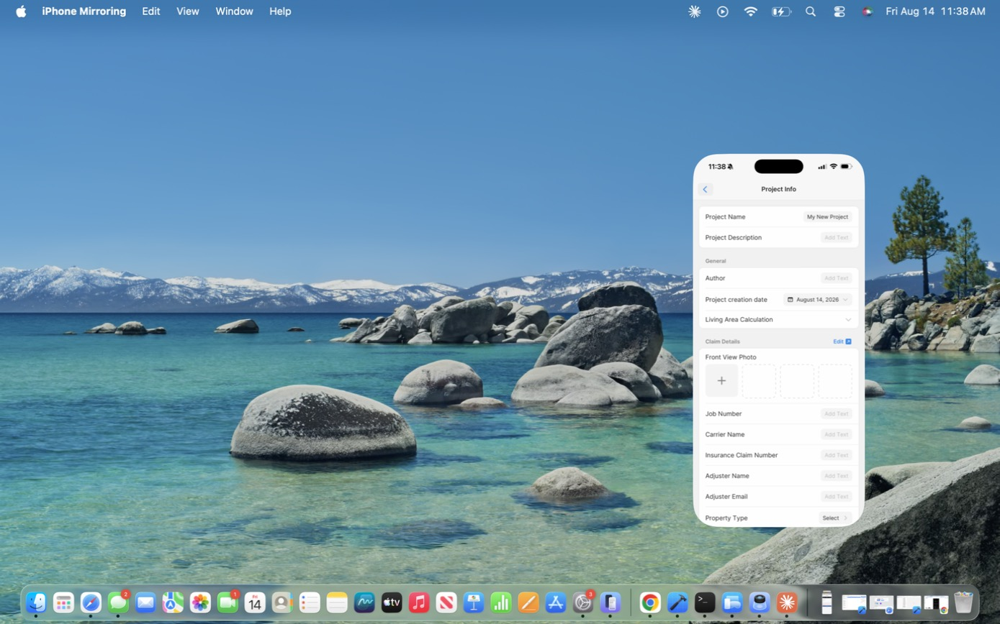 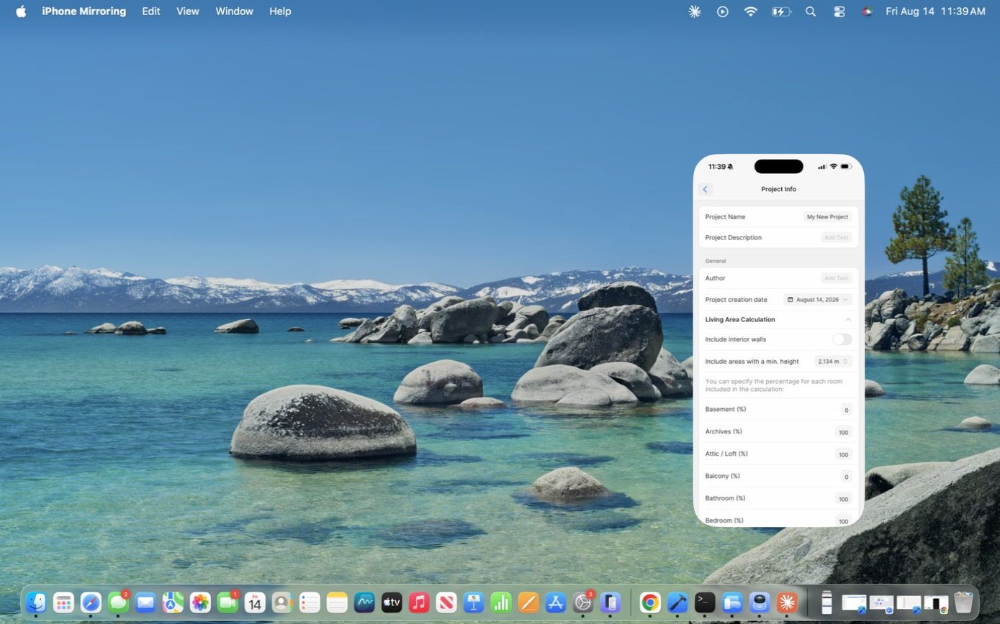

`Project Name` · `Project Description` · **General**: Author, Project creation date, `Living Area Calculation` (collapsible, see §3) · **Claim Details** (`Edit ↗`): Front View Photo, Job Number, Carrier Name, Insurance Claim Number, Adjuster Name, Adjuster Email, Property Type, Type of Loss, Loss Date.

### 4.4 Floor plan editor

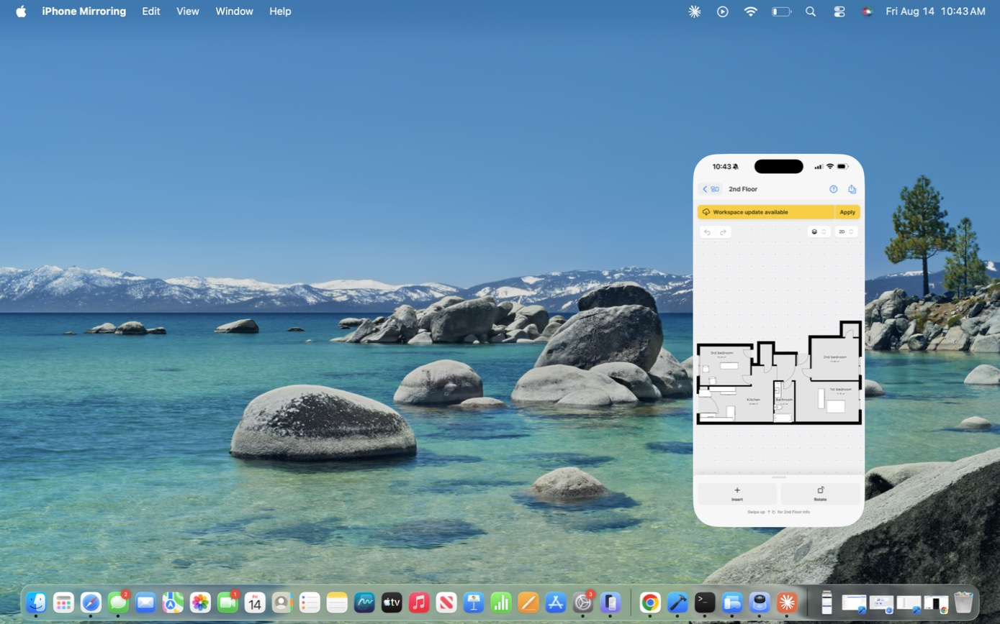 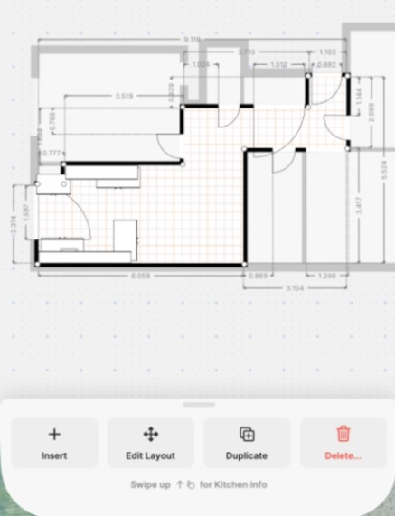

**Chrome:** back + floor-switcher icon · title (+ subtitle at deeper levels) · `?` · export. Second row: undo / redo left; floor-switcher and view-mode steppers right.

**Canvas:** dotted grid with periodic blue `+` crosshairs; rooms drawn with a grey wall band outside a black inner line; unselected rooms grey-filled with centred `<name> <area>`; selected room gets a hatched fill, white circular corner handles and full dimension strings.

**Floor switcher:** full-screen `All Floor Plans — n items`, 2-column thumbnails, current outlined blue, dashed `Add Floor` tile.

**Add Floor sheet:** grouped `Most common` (Ground Floor, 1st–4th Floor) then `Other floors` (Basement levels 1–3, Land survey, Semi-Basement, Higher Ground Floor, 5th Floor upward). Copy the "most common first" split.

**View modes:**

- **2D** — the only editable mode
- **3D** — extruded massing, header reads `3D View • Read Only`, action bar hidden, one-finger drag pans
- **Elevation** — straight-on wall face with side walls folded away in perspective; openings drawn architecturally; height dimensions on both jambs, wall length below, offset chain above. Gated to room level with the reason shown inline: *"Only available inside rooms"*; hint *"You can also double-tap on a wall"*.

**Room selected:** every wall gets a dimension string; siblings grey out.

**Edit Layout:** room fills light blue, dimensions hide, two blue manipulators appear at centre — a 4-way move arrow and a curved rotate arrow. Action bar reduces to Insert / Duplicate / Delete.

**Object selected:** blue bounding box; the host wall's dimension chain splits into `offset · object width · offset` with drag handles at the segment ends.

### 4.5 Measurement entry — `Change Measurement`

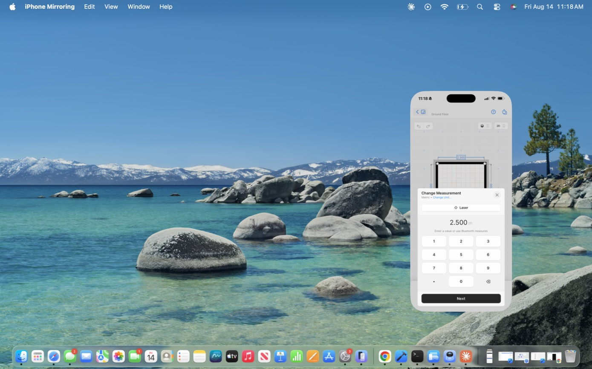 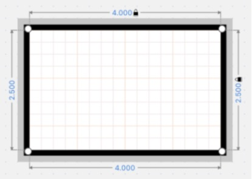

The most important component in the app. Modal panel, canvas stays visible above with the active wall highlighted:

- Title + `Metric • Change Unit…` link
- `⊕ Laser` — pair a Bluetooth laser distance meter
- Large value readout with unit
- Helper: *"Enter a value or use Bluetooth measures"*
- Custom numeric keypad (1–9, `.`, 0, backspace) — **not** the system keyboard
- Primary button: `Next` while walls remain, `Apply` on the last one

Geometry updates live as you advance. Wall-by-wall sequential entry with a live preview is the whole UX; a generic form with four text fields is not the same product.

**Change Units:** segmented `Metric | Feet | Inches`, then a picker wheel of *precision variants* — 2.50 m / 2.500 m / 250 cm / 250.0 cm; 1' 6" / 1' 6" 1/2" / 1' 6" 1/4"; 18" / 18" 1/2" / 18" 1/4". Unit system and display precision are one combined choice. Footnote: *"Changes will affect the current and new projects. Existing projects will not be affected."*

### 4.6 Insert

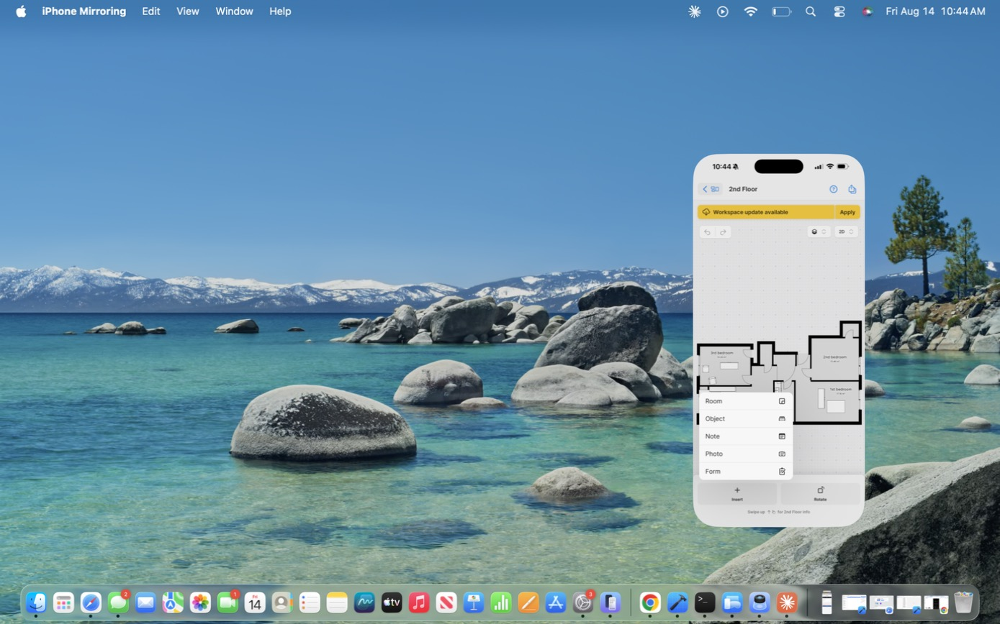 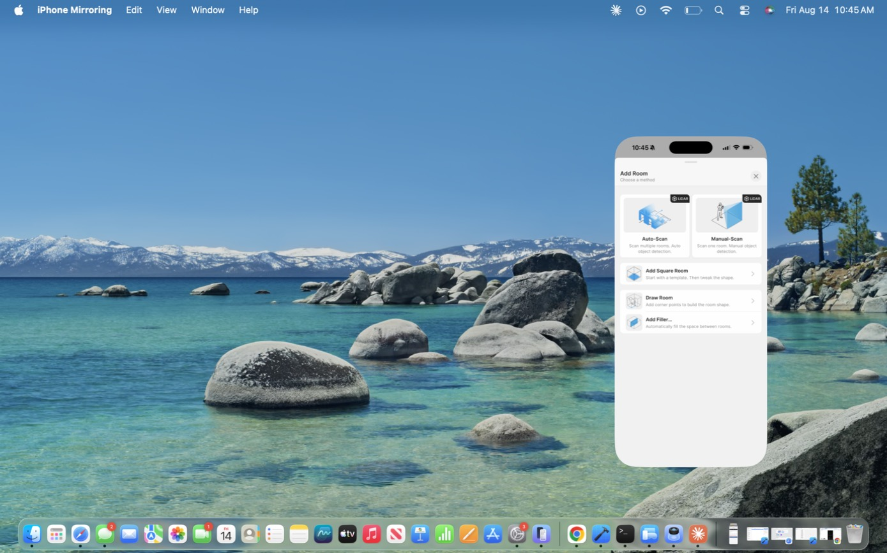

`Insert` popover: **Room · Object · Note · Photo · Form**. Items attach to the **current selection context** — with a door selected, `Insert → Note` opens the door's own Notes, not a canvas annotation.

**Add Room — method chooser:**

| Method | Presentation | Description |
|---|---|---|
| Auto-Scan | large card, `LiDAR` badge | "Scan multiple rooms. Auto object detection." |
| Manual-Scan | large card, `LiDAR` badge | "Scan one room. Manual object detection." |
| Add Square Room | list row | "Start with a template. Then tweak the shape." |
| Draw Room | list row | "Add corner points to build the room shape." |
| Add Filler… | list row | "Automatically fill the space between rooms." |

Hardware-accelerated paths are promoted to illustrated cards; manual fallbacks are demoted to rows.

**Select Room Type** — every method routes through this. Segmented `Residential | Commercial`; list starts at 6 common types with `See more`.

- Residential: Kitchen, Dining Room, Living Room, Hall, Bedroom, Primary Bedroom, Children Bedroom, Bathroom, Half Bathroom, Closet, Study, Music Room, Balcony, Garage, Hallway, Laundry Room, …
- Commercial: Private Office, Shared Office, Open Space, Meeting Room, Conference Room, Reception, Kitchenette, Cafeteria, Hall, Closet, Balcony, Garage, Hallway, Lounge, Waiting Room, Workshop, …

**Add Square Room** → drops a 2.500 × 2.500 m room, already selected, with `Set Size` in the action bar.

**Draw Room** → `Cancel` · *"Close the shape to save"* · undo/redo. Existing rooms ghost grey for context. Tap places a corner (blue 4-way handle on the active one, hollow dot on the previous). Nothing persists until the polygon closes. Cancel → single red `Discard Changes` confirm.

**Photo source menu:** `Camera` — *"Take Photo, 360 or Video"*; `Photo Library` — *"Choose Photo or Video"*. 360° capture is first-class.

### 4.6a Auto-Scan (LiDAR) — captured from screen recording

Documented from a 2:50 on-device screen recording of a real Auto-Scan in a workshop/garage,
14 Aug 2026. Frame quality is limited (mirrored playback), so this describes states and
behaviour rather than pixel geometry.

**Sequence**

1. `Insert` → `Room` → **Auto-Scan** (the method chooser's 5th row is contextual: *Import & Draw*
   — "Trace over an image of an existing plan" — on an empty floor; *Add Filler…* once rooms exist)
2. **Calibration prompt** — background dims, a white wall-shaped outline and a small phone-position
   indicator appear, captioned **"Point camera at top edge of wall"**
3. **Scanning state** (see below)
4. Stop → footprint freezes, `Done` appears top-left, chip changes to **"Scan another room"** —
   this is the multi-room chain
5. **Select Room Type** — Residential/Commercial, identical to the manual paths, but shown
   **after** the scan. Auto-Scan captures geometry first and classifies second.
6. **Review Scan** → `Confirm Scan`
7. Room lands in the 2D editor with walls, door swing arcs and window openings already placed

**Scanning HUD**

| Element | Behaviour |
|---|---|
| Status chip | Persistent, centred low: **"Scanning… / Stop after every room"** |
| Edge tracing | Glowing white lines snap along wall/ceiling/floor junctions as they resolve |
| Surface planes | Detected wall areas fill with translucent white quads |
| Opening detection | Doors and windows get their own white rectangle **plus a centre diamond handle** |
| Object rail | A collapsible chip stack on the right edge (`<` to expand) — detected items |
| `2D` / `3D` pill | Right side, toggles the inset preview mode |
| Inset mini-map | Dark rounded card, lower third. Live 2D build-up: green/orange wall traces plus a **cone cursor** showing camera position and heading. On stop, the footprint becomes a filled green polygon |
| Controls | Large red square **Stop** centre-bottom; white circle (capture) to its right |

The inset mini-map is the single best idea in this flow. The operator gets continuous feedback
on whether the polygon is closing, without leaving the camera view — which is what makes the
"stop after every room" discipline workable.

**Review Scan**

Modal sheet. Green check icon with a warning badge, heading **"Room scan complete, but…"**,
then a plain-language explanation of what was wrong and what the app did about it:

> *"'Kitchen' had an opening. To prevent data loss, we tried to close the room shape as shown below."*

Below it, a preview of the resulting polygon with the auto-closed edge drawn as a dashed/hatched
segment so the user can see exactly which wall was inferred. Single primary action: **`Confirm Scan`**.

**Failure mode observed.** A second room in the same recording produced a degenerate sliver — a
long thin wedge rather than a room. The same Review Scan sheet was shown, with the same
`Confirm Scan` button and no obvious "retry" affordance in view. Two lessons for a rebuild:

- Auto-closing an open polygon is the right default, but it must be *visible* and *reversible*.
- The review step needs a rejection path. Confirming a sliver puts garbage into the plan, and
  everything downstream — areas, wall areas, living area, the report — inherits it.

**Wall / Elevation navigation.** After scanning, a `Wall` screen (subtitle = floor name) is
reachable, showing one wall face at a time with **← →** buttons to step through the walls in
sequence, plus the standard `+ Insert`. This is the same Elevation mode described in §4.4,
but the arrow-stepper is worth noting — it turns wall-by-wall inspection into a linear task.

### 4.7 Object library

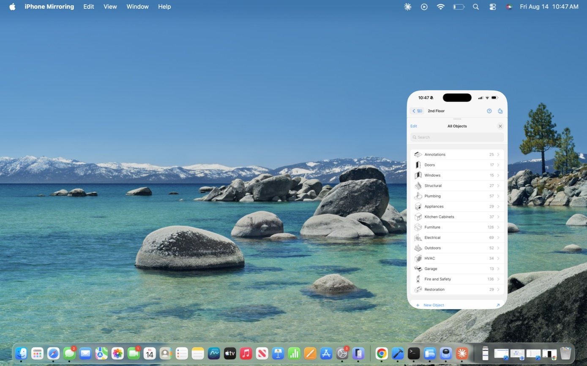 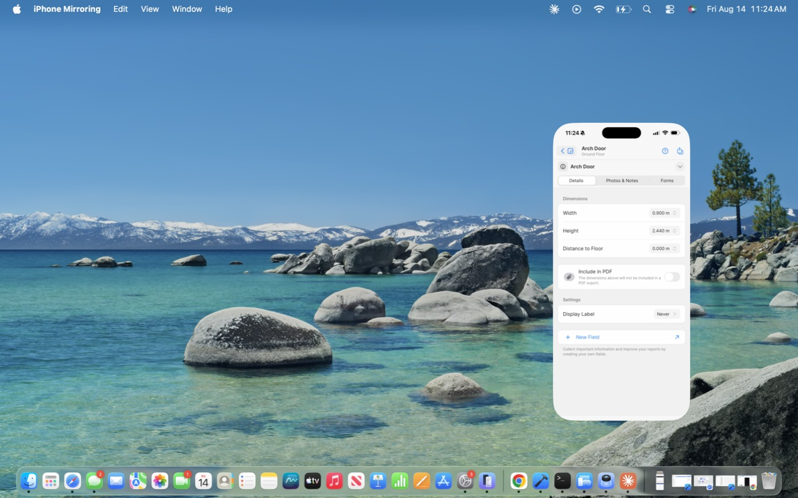

Sheet `All Objects`: `Edit` · title · `✕`, search, dismissible tip (*"You can now tap & hold to drag and drop the objects directly onto the canvas"*), `Recently used` rail, then categories:

| Category | Items | | Category | Items |
|---|---|---|---|---|
| Annotations | 25 | | Outdoors | 52 |
| Doors | 17 | | HVAC | 34 |
| Windows | 15 | | Garage | 13 |
| Structural | 27 | | Fire and Safety | 136 |
| Plumbing | 57 | | Restoration | 29 |
| Appliances | 29 | | | |
| Kitchen Cabinets | 37 | | | |
| Furniture | 126 | | | |
| Electrical | 69 | | | |

**666 objects across 14 categories.** Note the weighting: Fire and Safety (136) and Restoration (29) are there for the insurance/restoration buyer, not for interior design.

Category screen: back · `<Category> / n items` · `✕`, search, 2-column grid. Cards carry an isometric render, a favourite star, and the name. Renders include red swing-direction arrows on doors.

**Placement gating:** objects are only insertable with a room active. With nothing selected every card dims under *"Only available in rooms"*. Selecting a room re-enables the library. Disabled states always explain themselves.

**Insert flow:** picking a door auto-snaps it into the nearest wall and immediately selects it. `Replace with…` reopens the picker **pre-filtered to the same category**.

**Object inspector — Details:** Width · Height · Distance to Floor; `Include in PDF` toggle (*"The dimensions above will not be included in a PDF export"*); `Display Label` → `Never / Above the object / Over the object / Below the object`, each option shown as a radio plus a micro-diagram.

### 4.8 My Account

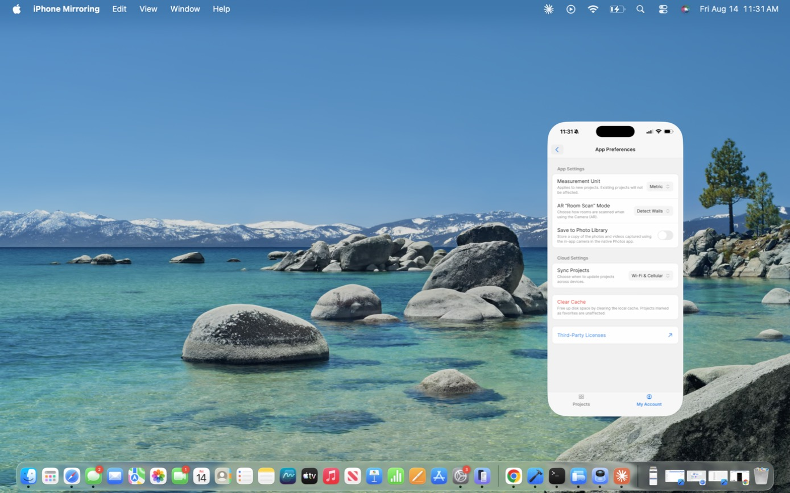

| Group | Rows |
|---|---|
| — | Profile |
| Workspace + `Owner` badge | Company Profile · Subscription · Invite Members ↗ |
| — | App Preferences · Privacy |
| — | Help & Support · Create & Share Diagnostics · Report a Bug ↗ · Suggest a Feature ↗ · What's New ↗ |
| — | Rate App |

**App Preferences**

- *App Settings*: `Measurement Unit` (*"Applies to new projects. Existing projects will not be affected."*); **`AR "Room Scan" Mode`** → `Detect Walls` (*"Use LiDAR sensors for better accuracy"*) or `Detect Corners` (*"Use legacy method that does not rely on LiDAR sensors"*); `Save to Photo Library` (off)
- *Cloud Settings*: `Sync Projects` → `Wi-Fi & Cellular`
- `Clear Cache` (red) — *"Projects marked as favorites are unaffected."*
- Third-Party Licenses ↗

Two scan engines — a LiDAR path and a legacy corner-tapping path — is a real architectural decision worth mirroring if you want to support older devices.

**Privacy:** `Share Analytics` toggle + Privacy Policy / Terms of Service / License Agreement.

**Company Profile:** logo tile with `···`, company name, an editable contact card (phone / email / website / fax), an address card, and a **Watermark Preview** rendering the branded export header (company text block left, logo right, plan below, footer rule) with `Add Watermark…`. Branding configured once here flows into every export.

---

## 5. Export system

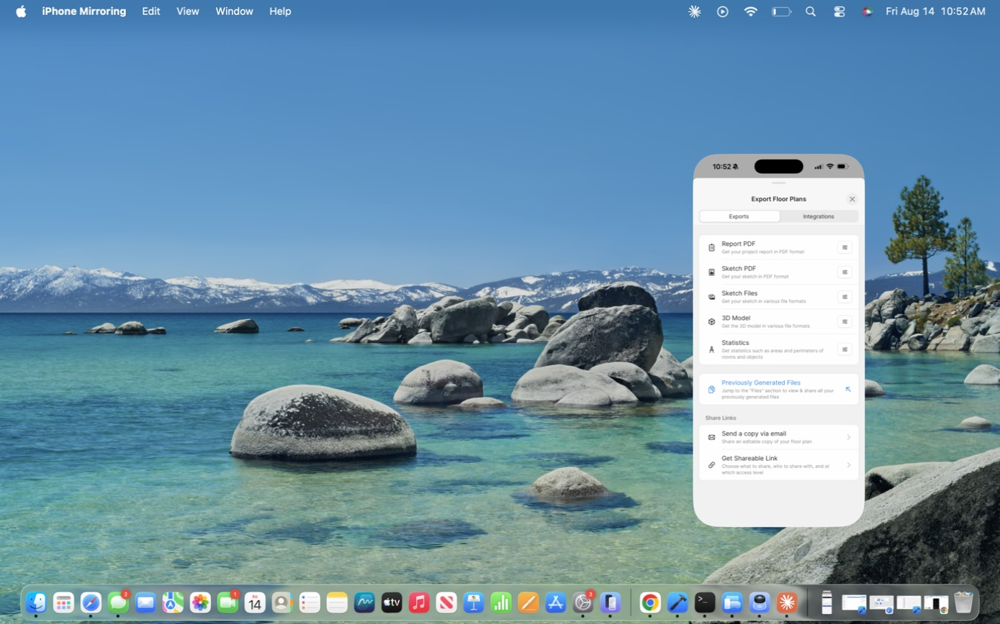

Sheet `Export Floor Plans`, tabs **Exports | Integrations**. Every row taps into a settings screen (`Cancel` / title / `Done`) — never a blind generate. Outputs land in the project's **Files** section for later re-sharing.

| Export | Formats / notes |
|---|---|
| **Report PDF** | full project report |
| **Sketch PDF** | plan only, adds `Hide annotation objects` and a **Title Block** group |
| **Sketch Files** | JPG (opaque, no headers/pictures/annotations) · PNG (transparent) · DXF (vector, CAD-importable, one per floor) · SVG (vector, one per floor) |
| **3D Model** | OBJ (per floor, off) · IFC (per project, for BIM, on) · USDZ (per floor, for AR, on) |
| **Statistics** | PDF and/or CSV; `Include`: Furniture, Wall Objects |

**Share Links:** `Send a copy via email` (editable copy) and `Get Shareable Link` (*"Choose what to share, who to share with, and at which access level"*). Both deliberately left unopened — they send/publish.

**Select Page Layout** (shared component): All floors in one file · One floor per file · One floor per page & one room per page · One floor per page & two rooms per page — radio + layout diagram each.

**Report PDF settings** (the fullest example):

| Group | Controls |
|---|---|
| Page Layout | All Floors & All Rooms |
| Page Size | US Letter |
| Room Labels | Show all room names |
| Scale | Display scale · Floor Scale · Room Scale · Rotate plan to maximize scale · Use the same scale for all floors |
| Floor Plan Dimensions | Detailed dimensions · Main dimensions · Area · **Only dimensions that have been manually set** |
| Room Plan Dimensions | Select Dimensions |
| Include Attachments | Dimensions · Fields · Photos & Videos (*Photos, 360° Photos, Videos*) · Notes · Forms |
| Forms | Place each form on its own page |
| Pictures | Photos size · Place photos on dedicated pages · Show photo captions · Show miniature photos in annotations |
| Disclaimer | editable legal text block |

A sample thumbnail (`Kitchen / 3.6 × 4.2 / 15 m²`) sits inline in the *Floor Plan Dimensions* group to illustrate the toggles. It is a **static illustration**, not live project data — the same sample appears in Sketch PDF settings. If you build this, wire it to the real plan; it's a cheap win.

Sketch PDF **Title Block**: Display Title Block · Display the number of floors & rooms · Display Area · Show personal email.

**Integrations tab:** empty here — *"Integrate with other industry-leading tools to seamlessly share floor plan data."*

---

## 6. Interaction patterns worth stealing

1. **Universal inspector.** One swipe-up, multi-detent sheet, always `Details / Photos & Notes / Forms`, for floor, room and object alike. Canvas stays visible above it.
2. **Contextual action bar.** The bottom bar rewrites itself per selection depth. Users never hunt in menus.
3. **Collection shell.** Section title + chevron → sort caption → `See All (n)` → horizontal rail with a leading `+`. Reused for Floor Plans, Photos, Files, Objects, and the object grids.
4. **Capability gating with a stated reason.** *"Only available in rooms"*, *"Only available inside rooms"*. Never a silent dead control.
5. **Promoted vs demoted creation paths.** LiDAR gets illustrated cards; manual methods get rows.
6. **Destructive actions are two-step and red.** `Discard Changes`; `Exit All → Yes, I'm sure`; `Archive…` / `Delete…` with trailing ellipsis.
7. **Config-first exports.** Settings screen with Cancel/Done before anything generates; artefacts persist in Files.
8. **Explicit sync.** Persistent yellow banner + manual `Apply`, plus a user-chosen sync policy and an offline-by-favouriting model.
9. **Definitions in the UI.** Every statistic carries an `(i)` with its formal definition. In a domain where "floor area" has five legitimate meanings, this is what makes the number defensible in a claim.
10. **Domain-specific numeric keypad.** Custom pad + laser integration beats the system keyboard for measurement entry.
11. **Most-common-first lists.** Add Floor and Select Room Type both surface a short common set with `See more` behind it.

---

## 7. Design system (approximate)

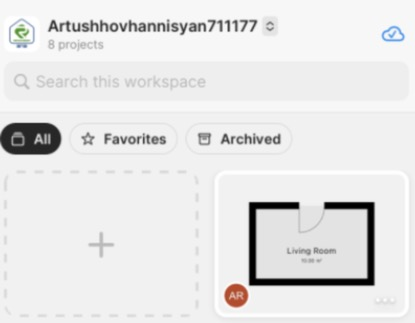

Read off screenshots — treat as a starting point and verify with a colour picker before committing tokens.

**Platform:** stock SwiftUI/UIKit idioms throughout — system segmented controls, iOS toggles, grouped inset lists, SF Symbols-style glyphs. Very little custom chrome. Cheapest path to a familiar-feeling rebuild is to lean on the platform the same way.

| Token | Value |
|---|---|
| Accent / interactive | iOS system blue (~`#007AFF`) — links, selected tabs, radio fills, dimension text, primary buttons |
| Destructive | iOS system red (~`#FF3B30`) — Delete, Archive, Clear Cache, Discard |
| Toggle on | iOS system green (~`#34C759`) with a check glyph inside the knob |
| Warning / banner | soft yellow banner, dark text, inline action button |
| Surface | white cards on a light grey grouped background (~`#F2F2F7`) |
| Text | near-black primary, mid-grey secondary/captions, grey placeholders |
| Avatar chip | rust/dark-red circle, white initials |

| Element | Style |
|---|---|
| Cards | white, ~14 px radius, soft shadow, no border |
| Empty/creation tiles | 2 px dashed grey border, same radius, centred grey `+` |
| Search field | grey fill, pill-ish radius, leading magnifier |
| Filter chips | selected = solid dark pill, white label + icon; unselected = white pill, hairline border |
| Grouped list rows | inset white group, hairline separators, label left / value + chevron right |
| Segmented control | stock iOS, white selected thumb on grey track |
| Bottom action bar | white bar, icon-over-label items, evenly distributed, destructive item tinted red |
| Tab bar | 2 items, blue active / grey inactive |
| Modal sheets | rounded top corners, grabber, multi-detent |

**Canvas rendering**

| Element | Treatment |
|---|---|
| Background | light grey, dotted grid, periodic blue `+` crosshairs |
| Walls | grey outer band (thickness) + solid black inner line |
| Room fill, unselected | flat light grey, centred name + area |
| Room fill, selected | fine white/hatched grid |
| Corner handles | white circles, dark ring |
| Dimensions | blue text on thin blue extension lines with tick ends; padlock glyph on manually-set values |
| Selected object | blue bounding box; host wall chain splits with drag handles |
| Edit Layout | light blue room fill, blue 4-way move + curved rotate manipulators |
| Elevation | wall face straight on, side walls folded away in grey perspective |

**Typography:** system font throughout. Large-title workspace name (~17–20 pt semibold), 17 pt row labels, 15 pt secondary values, 12–13 pt captions and helper text, 11 pt tab labels. Section headers are small grey uppercase-ish labels above inset groups.

---

## 8. Gaps

Still undocumented, roughly in priority order for a rebuild:

1. **Manual-Scan.** Auto-Scan is now documented in §4.6a from a screen recording. Manual-Scan
   ("Scan one room. Manual object detection.") has not been captured — the object-placement
   interaction during a manual scan is the open question.
4. **Detected-object rail.** Visible as a collapsed chip on the right edge during Auto-Scan;
   never expanded on camera. Unknown whether it lists detections for confirmation/rejection.
5. **Detect Corners mode.** The non-LiDAR legacy engine (App Preferences → AR "Room Scan" Mode)
   is unseen. Needed if we want to support pre-LiDAR devices.
6. **`Add Filler…`** — entry point only.
7. **Share Links** (`Send a copy via email`, `Get Shareable Link`) — access-level model unknown; deliberately not opened.
8. **Forms builder.** Every entity has a Forms tab but all were empty (*"Reduce paperwork by creating report templates, forms, questionnaires, checklists…"*). The authoring surface appears to be web-based (`Learn more ↗`). Probably significant.
9. **`+ New Field` / `Edit` on field groups** — external ↗, likely web console. Same for `+ New Object`.
10. **Subscription / paywall tiers** — not opened; tier gating rules unknown.
11. **Photos and Files `See All` galleries**, project `Forms` screen, floor-level `Rotate`.
12. **Multi-floor behaviour** — floor stacking/alignment, and whether upper floors trace lower ones.
13. **Affected Areas** — `+ Add New Area` not exercised; the feature ties into exports.

---

## 9. Screen index

All files live in `screens/`. Open only what you need.

### Workspace & projects
| File | Screen |
|---|---|
| `01-projects-list.jpg` | Projects list — header, search, filter chips, card grid |
| `02-projects-list-header-detail.jpg` | Close-up: workspace header, search field, chips, dashed create tile |
| `03-project-cards-detail.jpg` | Close-up: project card anatomy, avatar chip, `···` |
| `04-tab-bar-detail.jpg` | Close-up: two-item tab bar, active/inactive treatment |
| `05-project-card-overflow-menu.jpg` | Card `···` menu — Favorite / Move / Duplicate / Archive |
| `06-switch-workspace.jpg` | Workspace switcher modal, `Current` chip |
| `07-favorites-empty-state.jpg` | Favorites empty state (offline-access explainer) |
| `08-archived-empty-state.jpg` | Archived empty state (indefinite retention explainer) |
| `09-new-project-created-empty.jpg` | Result of tapping New Project — no wizard |
| `10-empty-project-sections.jpg` | Empty-section value-proposition captions |

### Project
| File | Screen |
|---|---|
| `11-project-detail-populated.jpg` | Project detail — sync banner, address, statistics tiles |
| `12-project-detail-floorplans-photos.jpg` | Floor Plans and Photos collection rails |
| `13-project-detail-files.jpg` | Files section with generated report PDF |
| `14-project-detail-sandbox.jpg` | Project detail after adding one floor/room |
| `15-project-title-menu.jpg` | Title `⌄` menu |
| `16-project-info-claim-details.jpg` | Project Info — general + Claim Details field group |
| `17-living-area-calculation.jpg` | Living Area Calculation rules engine |
| `18-claim-details-fields.jpg` | Full Claim Details field list |

### Editor — chrome & views
| File | Screen |
|---|---|
| `19-floorplan-editor-2d.jpg` | 2D editor, full plan |
| `20-floorplan-editor-2d-detail.jpg` | Close-up: wall rendering, room labels, door swings |
| `21-view-mode-menu.jpg` | View mode menu, Elevation disabled with reason |
| `22-view-mode-menu-elevation-enabled.jpg` | Same menu with Elevation enabled inside a room |
| `23-3d-view.jpg` | 3D read-only view |
| `24-floor-switcher.jpg` | All Floor Plans grid |
| `25-add-floor-sheet.jpg` | Add Floor — "Most common" / "Other floors" split |
| `26-empty-floor-editor.jpg` | Empty floor, Insert-only action bar |
| `63-elevation-view.jpg` | Elevation view of a wall |
| `64-elevation-view-detail.jpg` | Close-up: opening drawn architecturally, dimension chain |

### Editor — room creation & measurement
| File | Screen |
|---|---|
| `27-insert-menu.jpg` | Insert popover — Room / Object / Note / Photo / Form |
| `28-add-room-method-chooser.jpg` | Add Room method chooser |
| `29-add-room-method-chooser-detail.jpg` | Close-up of the same |
| `30-select-room-type.jpg` | Select Room Type, collapsed common list |
| `31-room-types-residential.jpg` | Residential room types expanded |
| `32-room-types-commercial.jpg` | Commercial room types |
| `33-draw-room-canvas.jpg` | Draw Room canvas with ghosted context |
| `34-draw-room-handles-detail.jpg` | Close-up: corner placement handles |
| `35-discard-changes-confirm.jpg` | Destructive confirm pattern |
| `36-square-room-created.jpg` | Add Square Room result, 5-item action bar |
| `37-square-room-detail.jpg` | Close-up: corner handles, dimension styling |
| `38-change-measurement-panel.jpg` | **Change Measurement** — custom keypad, Laser, Next |
| `39-change-units-metric.jpg` | Change Units — metric precision wheel |
| `40-change-units-feet.jpg` | Feet with fractional precision |
| `41-change-units-inches.jpg` | Inches with fractional precision |
| `42-measurement-next-live-resize.jpg` | Live geometry update, button becomes Apply |
| `43-room-resized.jpg` | Committed 4.000 × 2.500 room |
| `44-manually-set-dimension-padlock.jpg` | **Padlock on manually-set dimensions** |
| `45-edit-layout-mode.jpg` | Edit Layout mode |
| `46-edit-layout-handles-detail.jpg` | Close-up: move + rotate manipulators |

### Editor — selection & inspectors
| File | Screen |
|---|---|
| `47-room-selected.jpg` | Room selected, siblings greyed |
| `48-room-selected-dimensions-detail.jpg` | Close-up: full dimension strings |
| `49-room-inspector-details.jpg` | Room inspector — statistics, dimensions, affected areas |
| `50-room-inspector-photos-notes.jpg` | Photos & Notes tab |
| `51-forms-empty-state.jpg` | Forms tab empty state |
| `52-floor-inspector-wall-thickness.jpg` | Floor inspector — interior/exterior wall thickness |
| `61-object-inspector-details.jpg` | Object inspector — W/H/distance, Include in PDF |
| `62-display-label-options.jpg` | Display Label radio + micro-diagram pattern |

### Editor — objects
| File | Screen |
|---|---|
| `53-object-library-all-objects.jpg` | All Objects sheet, recently used rail |
| `54-object-library-categories.jpg` | Full category list with counts |
| `55-object-category-doors-gated.jpg` | Doors grid, gated |
| `56-object-gating-detail.jpg` | Close-up: "Only available in rooms" |
| `57-object-library-enabled-in-room.jpg` | Same library enabled with a room active |
| `58-replace-with-prefiltered.jpg` | Replace with… pre-filtered to category |
| `59-object-inserted-arch-door.jpg` | Door auto-snapped into wall |
| `60-object-dimension-chain-detail.jpg` | Close-up: offset / width / offset chain |
| `65-add-note-modal.jpg` | Add Text modal (note attaches to selection) |
| `66-photo-source-menu.jpg` | Camera (Photo/360/Video) vs Photo Library |

### Statistics
| File | Screen |
|---|---|
| `67-statistics-rooms.jpg` | Statistics — Rooms tab, full metric list |
| `68-statistic-definition-popup.jpg` | `(i)` formal definition popup |
| `69-statistics-objects.jpg` | Objects tab — bill of materials |

### Export
| File | Screen |
|---|---|
| `70-export-hub.jpg` | Export Floor Plans hub |
| `71-integrations-empty.jpg` | Integrations empty state |
| `72-select-page-layout.jpg` | Shared Select Page Layout component |
| `73-report-pdf-settings-1.jpg` | Report PDF — layout, page size, scale |
| `74-report-pdf-settings-2.jpg` | Report PDF — dimension toggles |
| `75-report-pdf-settings-attachments.jpg` | Include Attachments group |
| `76-report-pdf-settings-pictures.jpg` | Pictures group + disclaimer |
| `77-sketch-pdf-settings-1.jpg` | Sketch PDF — adds Hide annotation objects |
| `78-sketch-pdf-title-block.jpg` | Title Block group |
| `79-sketch-files-formats.jpg` | JPG / PNG / DXF / SVG with descriptions |
| `80-3d-model-formats.jpg` | OBJ / IFC / USDZ |
| `81-statistics-export-settings.jpg` | PDF + CSV, Include Furniture / Wall Objects |

### Account & settings
| File | Screen |
|---|---|
| `82-my-account.jpg` | My Account root |
| `83-app-preferences.jpg` | App Preferences — units, AR mode, sync, cache |
| `84-ar-scan-mode-options.jpg` | **Detect Walls (LiDAR) vs Detect Corners (legacy)** |
| `85-privacy.jpg` | Privacy — analytics toggle, policy links |
| `86-company-profile.jpg` | Company Profile (contains real business details — do not ship) |
| `87-watermark-preview.jpg` | Export watermark preview |

### Scan flow (incomplete)
| File | Screen |
|---|---|
| `88-camera-blocked-alert.jpg` | iOS blocking camera over iPhone Mirroring |
| `89-scanner-shell.jpg` | Pre-scan shell — "Move iPhone to start" |
| `90-scanner-exit-confirm.jpg` | Two-step exit confirm |
